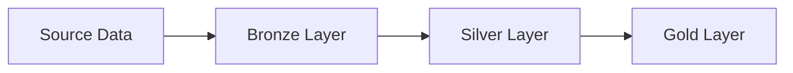

# Data Warehouse Project 🏢

## Overview
A comprehensive data warehouse solution that demonstrates end-to-end data storage capabilities, from warehouse construction to actionable insights generation.

## Author
**Christ Chadrak MVOUNGOU**  

## Project Architecture 🏗️

### Data Flow


### Data Sources
- **ERP System** (CSV files)
  - Customer data
  - Sales transactions
  - Product information
- **CRM System** (CSV files)
  - Customer interactions
  - Marketing campaigns
  - Lead tracking

## Technical Requirements 🛠️

### Data Engineering Components

1. **ETL Process**
   - Bronze layer: Raw data ingestion
   - Silver layer: Data cleaning & transformation
   - Gold layer: Analytics-ready datasets

2. **Data Quality**
   - Automated data validation
   - Duplicate detection
   - Missing value handling
   - Data type consistency checks

3. **Technologies Used**
   - Microsoft SQL Server
   - T-SQL for transformations
   - Stored procedures for modularity

## Project Structure 📁
```
sql-data_warehouse/
├── datasets/
│   ├── source_crm/
│   └── source_erp/
├── scripts/
│   ├── bronze/
│   ├── silver/
│   └── gold/
└── docs/
```

## Getting Started 🚀

### Prerequisites
- SQL Server 2019+
- Azure Data Studio (SQL Management)

### Installation
```bash
# Clone the repository
git clone https://github.com/your-username/sql-data_warehouse.git

# Navigate to project directory
cd sql-data_warehouse

# Run initialization script
sqlcmd -S localhost -i scripts/init_database.sql
```

## Documentation 📚
- Full data model documentation in `/docs`
- ETL process flowcharts

## Features ✨
- Automated data loading
- Data quality monitoring
- Performance optimization

### Thank you
